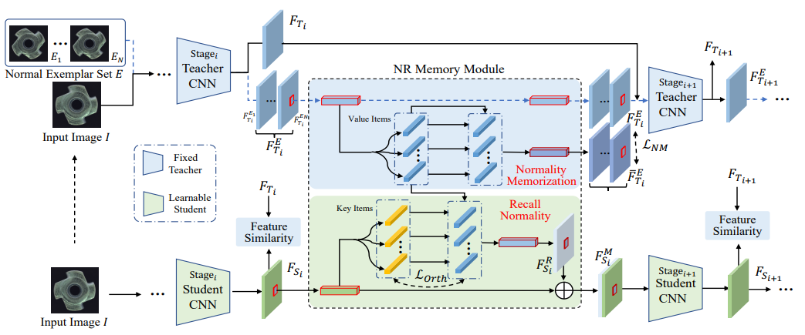

<p align="center">
  <h1><center> Remembering Normality </center></h1>
</p>

## Unofficial implementation of the paper : "Remembering Normality: Memory-guided Knowledge Distillation for Unsupervised Anomaly Detection" [Article](https://openaccess.thecvf.com/content/ICCV2023/papers/Gu_Remembering_Normality_Memory-guided_Knowledge_Distillation_for_Unsupervised_Anomaly_Detection_ICCV_2023_paper.pdf)
 


<p align="left">
  
</p>

We designed the code following the guidelines of the official [Paper](https://openaccess.thecvf.com/content/ICCV2023/papers/Gu_Remembering_Normality_Memory-guided_Knowledge_Distillation_for_Unsupervised_Anomaly_Detection_ICCV_2023_paper.pdf) and its [Supplementary materials](https://openaccess.thecvf.com/content/ICCV2023/supplemental/Gu_Remembering_Normality_Memory-guided_ICCV_2023_supplemental.pdf)

## Getting Started

You will need [Python 3.10+](https://www.python.org/downloads) and the packages specified in _requirements.txt_.

Install packages with:

```
$ pip install -r requirements.txt
```

## Configure and Run
To run the code, please download the MVTEC AD dataset and add the path in the config.yaml file 
Link to download the dataset : https://www.mvtec.com/company/research/datasets/mvtec-ad 

To run train and test the model :  
With STPM backbone ([Article](https://arxiv.org/pdf/2103.04257v2.pdf))
```
python trainRM_ST.py  
```
With RD backbone ([Article](https://arxiv.org/pdf/2201.10703.pdf))
```
python trainRM_RD.py  
```

To modify the object categories or hyperparameters, you can modify the config.yaml file.

- `data_path` (STR): The path to the dataset
- `backbone` (STR): The name of the model backbone (either resnet18 or wide_resnet50_2)
- `obj` (STR): The object category
- `phase` (STR): Either train or test
- `save_path` (STR): The path to save the model weights
- `training_data`: 
- - `epoch` : number of epoch for training
- - `batch_size` : the minibatch size
- - `lr` : the learning rate img_size
- - `img_size` : Size for the image resizing
- - `crop_size` : Size for the image cropping (if equal to img_size, no cropping)
- - `embed_dim` : The parameter L from the paper (number of keys and values)
- - `n_embed` : The parameter N from the paper, the number of normal sample for normality embedding learning
- - `lambda1` : The parameter lambda1 from the paper (ponderation of the lossNM)
- - `lambda2` : The parameter lambda2 from the paper (ponderation of the lossORTH)

## List of TODOs

- [x] Implement cosine similarity for score calculation
- [x] Implement RD
- [ ] Implement VisA, MVTec 3D-AD and eyecandies datasets
- [ ] Implement visualisation


## License

This project is licensed under the MIT License.